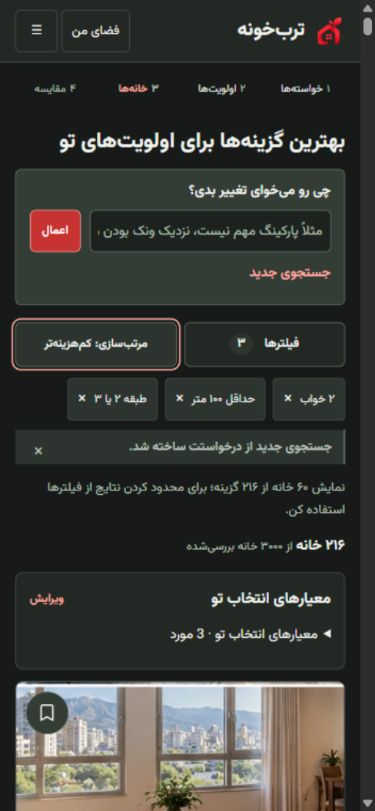

# ترب‌خونه

Intent-first housing search: describe your priorities in Persian, refine them conversationally, and compare homes with inspectable reasons and trade-offs.

نمونه مفهومی مستقل برای چالش AI Product Engineer ترب؛ محصول رسمی ترب نیست.

## What problem does it solve?

Housing filters capture attributes, but often miss why someone wants them. ترب‌خونه separates hard requirements from preferences, keeps workplace context distinct from residential location, and shows what an advertisement actually supports rather than assuming missing evidence means “no”.

## Demo capabilities

- Persian natural-language search and conversational refinement of a canonical intent.
- Exact/nearby residential location and workplace-aware proximity.
- Hard versus soft requirements, relative priorities, conditional preferences and progressive fallback.
- Contradiction handling and listing evidence with YES / NO / UNKNOWN states.
- Explainable deterministic ranking, comparison of up to three homes, session-backed Saved, and an advertiser-contact demo.

## Example queries

- «دو خواب در ونک، حداقل ۸۰ متر، اجاره تا ۳۰ میلیون»
- «محل کارم ونکه، نور خیلی مهمه، پارکینگ ترجیحیه»
- «پارکینگ مهم نیست؛ رفت‌وآمد از همه چیز مهم‌تره»
- «اگر طبقه بالاتر از دوم بود آسانسور حتماً داشته باشه»
- «اول ونک، اگر نبود یوسف‌آباد»

Interpretations are reviewable before search. Follow-up references require existing context; supported phrase families and exact regression cases are documented in [the language assets](docs/search_language/README.md).

## How it works

Persian input → normalization / parsing → **SearchIntent** → eligibility / evidence → deterministic ranking → explanations.

This is a Django monolith. `config/` contains settings and routes; `finder/` owns the model, language layer, search state, eligibility, ranking, forms, templates and session utilities. [Architecture notes](docs/ARCHITECTURE.md) describe module boundaries. `docs/` contains language specifications and screenshots; `data/` documents optional historical-data acquisition. CSS source and compiled output are both in `finder/static/finder/`.

## Data and AI

The reviewed local product used **3,000 historical, anonymized Divar real-estate records**, alongside 12 synthetic listings. This public copy excludes the working database and downloaded raw subset pending redistribution review. The included `seed_demo` command recreates the 12 synthetic listings offline. [Data instructions](data/README.md) explain optional acquisition/import for real mode; that download depends on an external archive and was not reverified during public preparation.

Property images are **illustrative demo images, not the original listing photos**. Historical listings do not establish current availability or prices.

The prototype does not depend on a paid live LLM API. Natural-language interpretation uses deterministic, testable parsing/semantic rules, with curated demo scenarios. The provider boundary can later enhance/replace the language layer with an LLM while preserving deterministic eligibility and ranking.

## Running locally

Verified environment: **Python 3.12.14, Django 5.2.17**, Windows PowerShell. Python 3.12 is the supported/reviewed version. From the repository root:

```powershell
python -m venv .venv
.\.venv\Scripts\python.exe -m pip install -r requirements.txt
$env:DATA_MODE = "synthetic"
$env:DJANGO_DEBUG = "1"
# Optional stable local key; omit to use an ephemeral key generated at startup.
$env:DJANGO_SECRET_KEY = (& .\.venv\Scripts\python.exe -c "import secrets; print(secrets.token_urlsafe(50))")
.\.venv\Scripts\python.exe manage.py migrate
.\.venv\Scripts\python.exe manage.py seed_demo
.\.venv\Scripts\python.exe manage.py seed_demo_user
.\.venv\Scripts\python.exe manage.py runserver 127.0.0.1:8000
```

Open [the local demo](http://127.0.0.1:8000/). Search is anonymous; the contact screen offers **ورود با حساب آزمایشی** after seeding the non-privileged demo user. No password is shipped; new demo accounts have an unusable password. An optional locally supplied `KHANE_DEMO_PASSWORD` is hashed when seeding. Set `ENABLE_DEMO_LOGIN=0` to disable one-click login.

The source default remains `DATA_MODE=real`; **set synthetic explicitly** when using the public offline demo. `.env.example` lists configuration, but `.env` is not automatically loaded. Settings read process environment. DEBUG defaults to local development, allowed hosts are loopback/test hosts, and demo login is gated by DEBUG. This is not a production deployment setup. An ephemeral secret changes across processes/restarts; supply a stable private environment value if you need persistent sessions.

Committed CSS, fonts and images let you view the demo without Node. For CSS development:

```powershell
npm install
npm run build:css
```

Use `npm ci` for a lockfile-exact install. The lockfile resolves Tailwind 4.3.3. No frontend server is required.

## Testing

Baseline and final public gates: **555 Django tests pass** (including all existing 532 tests), **170 frozen implemented Class-A language cases pass**, and no migrations are pending.

```powershell
.\.venv\Scripts\python.exe manage.py check
.\.venv\Scripts\python.exe manage.py makemigrations --check --dry-run
.\.venv\Scripts\python.exe manage.py test
.\.venv\Scripts\python.exe audit_v09e/corpus_harness.py
npm run build:css
node --check finder/static/finder/app.js
node scripts/test-theme.cjs
node audit_v09e/release_cleanup_js_test.cjs
```

The 320 designed language cases comprise **170 implemented/frozen, 45 partial, 78 future, and 27 ambiguous/invalid**. All 320 are not implemented. Tests cover state/patch contracts, language, evidence, conditional/fallback ranking, offline import, authentication/contact, comparison, progressive updates and final/mobile regressions. Versioned filenames preserve implementation history. Normal corpus verification never regenerates frozen fixtures; the optional classification-generation function additionally requires PyYAML and is not part of local runtime or the verification gate.

## Screenshots

[Home](docs/screenshots/home.jpg) · [Results/mobile](docs/screenshots/results-mobile.jpg) · [Detail](docs/screenshots/detail.jpg) · [Comparison](docs/screenshots/comparison.jpg)



These are preserved release QA captures using the private historical dataset. Home/detail/comparison show the final polish checkpoint; the mobile capture includes the subsequent release cleanup. They are illustrative and do not imply that the real dataset ships here.

## Project limitations

Historical data, incomplete seller evidence, approximate straight-line proximity rather than routing, intentionally partial/future language families, session-backed utilities, demo contact information, and illustrative images. The offline synthetic demo does not reproduce the 3,000-record real inventory. Some advanced criteria have sparse evidence. No live availability, external messaging guarantee or production deployment is claimed.

## License and attribution

No project-wide license has been selected; do not infer MIT or other redistribution rights. Font licensing is preserved in `finder/static/finder/fonts/LICENSE.txt`. Dataset provenance and unresolved data/asset rights are documented in [data notes](data/README.md) and [attribution notes](docs/ATTRIBUTION.md).
