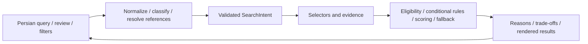

# Architecture

Django monolith, server-rendered Persian RTL pages, SQLite and session-backed utilities. The public preparation changes packaging/documentation and development configuration only.

## Contracts

**SearchIntent is the single source of truth.** Constraints, soft preferences, budget targets, workplace context, evidence preferences and compound logic remain distinct. Metadata records provenance; it does not maintain competing criteria. Review controls, natural-language edits and advanced filters all project into this state.

`query.py` classifies NEW_SEARCH versus PATCH. A contextual patch is a PATCH resolved against existing session context, not a third enum named CONTEXTUAL_PATCH. Unresolved references require clarification. `IntentPatch` applies validated sparse set/unset operations to a copy; omitted fields preserve prior values, explicit unsets restore canonical defaults.

Structured criteria originate from database fields. Evidence-derived criteria originate from conservative text extraction: **YES** is explicit support, **NO** is explicit negation, **UNKNOWN** is insufficient evidence. Absence never becomes a factual negative. Unknown evidence does not satisfy a hard evidence requirement; soft unknowns follow documented neutral scoring rather than invented facts. Seller claims remain claims.

Eligibility precedes scoring. Ranking uses explicit contributions, trust penalties, explanations and a stable listing-ID tie-break. Conditional logic applies only when its predicate holds. Relative priorities remain explicit. Fallback stages execute in declared order only when result-count triggers require them, and their effects appear in explanations. The candidate pool is materialized once so repeated stages can inspect it. Selectors avoid prematurely discarding candidates when compound rules may relax constraints.

## Module map

| Module | Responsibility |
|---|---|
| `config/` | Local settings, URL wiring, middleware, SQLite/static configuration |
| `finder/models.py`, `importing.py`, management commands | Listing persistence, bounded offline normalization, existing seeds/import |
| `language.py`, `intent.py`, `ai.py` | Persian normalization, phrase/number semantics, legacy profile and provider boundary |
| `query.py`, `patches.py`, `search.py` | Operation classification/reference resolution, sparse changes, canonical state and chips/recovery |
| `selectors.py`, `locations.py`, `location_registry.py` | Candidate queries, exact/nearby geography, canonical display names/workplace anchors |
| `evidence_features.py` | Auditable text extraction and tri-state evidence contracts |
| `ranking.py`, `compound.py` | Deterministic eligibility/weights/reasons, conditional and fallback engine |
| `advanced.py`, `forms.py`, `conflicts.py` | Form projections/serialization, validation and contradiction handling |
| `views.py`, `auth_views.py`, `contact.py`, `comparison.py` | Request orchestration, contact-only authentication and utility contracts |
| `templates/finder/`, `static/finder/` | Progressive server-rendered UI, JS enhancement, CSS source/output and local assets |

Advanced filters serialize changed fields only, preserving untouched values; displayed monetary units convert back into canonical integer toman. Search state, Saved and up-to-three comparison IDs use sessions. Login/logout preserve utility state. Contact information is intentionally demonstrative.

Partial Results fetches reuse server-rendered fragments and canonical server state, vary responses on the partial header and disable caching. The JavaScript reconnects enhancements after replacement and maintains history/focus; ordinary forms remain the fallback. Templates retain `lang="fa"`, `dir="rtl"`, semantic navigation, labels and accessible dialogue metadata.

## Tests and reproducibility

All 555 tests remain in their existing filenames. The frozen corpus is `finder/corpus_v09e_implemented.json`; `audit_v09e/corpus_classification.json` retains the reviewed 320-case classification, and the harness verifies the 170 enabled cases without rewriting expectations. The synthetic seed recreates 12 listings; real inventory requires the external archive acquisition/import described in `data/README.md`. No developer SQLite database is public.

